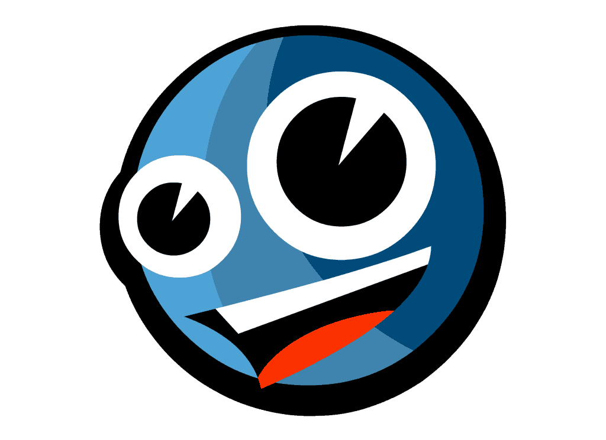

  

# Awesome indie dev  

> A curated list of awesome resources related to indie dev 

## Contents

- [Community](#Community)
- [iOS](#iOS)
- [HTTPS](#HTTPS)
- [CDN](#CDN)
- [Hosting](#Hosting)
- [Design](#Design)
- [Music](#Music)
- [Github](#Github)

### Community
- [indiehackers](https://www.indiehackers.com/)

### iOS
- [The swift programming language book](https://docs.swift.org/swift-book/)

### HTTPS
- [acme.sh - Free HTTPS services ](https://github.com/acmesh-official/acme.sh)
- [certbot.eff.org - Free HTTPS services  ](https://certbot.eff.org/)

### CDN
- [cloudflare - Free CDN services](https://www.cloudflare.com/zh-cn/cdn/)
- [jsdelivr  - Free CDN services](https://www.jsdelivr.com/)

### Hosting
- [Github pages](https://pages.github.com/)
- [Cloudflare pages](https://pages.cloudflare.com/)
- [Vercel](https://vercel.com/)
### Design
- [fontawesome - Icon materials ](https://fontawesome.com/)
- [iconfinder - Icon materials ](https://www.iconfinder.com/)
- [unDraw - Illustration materials](https://undraw.co/illustrations)
- [diagrams.net - Drawing Tools](https://app.diagrams.net/)

### Music
- [uppbeat.io - Free music for creators](https://uppbeat.io/)

### Github
- [shields.io - Github Custom Badge Generator](https://shields.io/)
- [emoji-cheat-sheet - Github emoji cheat sheet](https://github.com/ikatyang/emoji-cheat-sheet#table-of-contents)

### Experience
- [成为独立开发者第 2 年，这是我个人的编程学习经验](https://sspai.com/post/37643)
- [作为独立开发者，有哪些可以分享的经验？](https://www.zhihu.com/question/24667846)

## Contributions
If you want to participate in the project, feel free to PR ~
